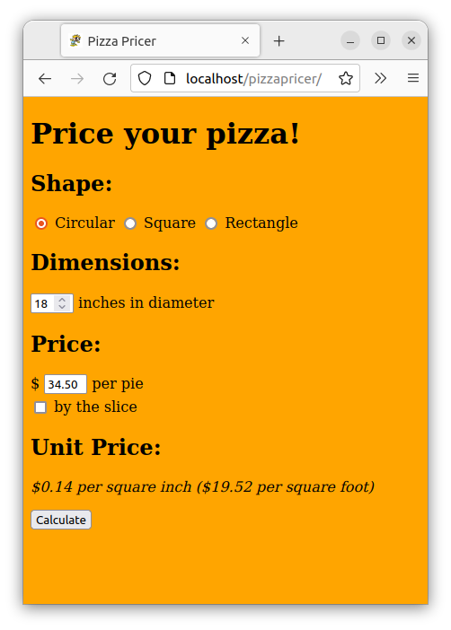

# Pizza Pricer

[](https://github.com/RichardLitt/standard-readme)

Don't be fooled by the hype: pizza ain't always cheap.  Make sure you are getting the best deals possible using the pizza unit pricer!

Future versions may include a way to post various pizza prices and calculate national averages.  There is a heavy demand for slicing through the bulls#@!.

## Install

All code (HTML, JavaScript, CSS) is in the root.  Simply clone the project to a directory on your server:
```
git clone https://github.com/rbrutherford3/Pizza-Pricer.git /path/to/html/root
```

## Usage

Instructions to price your pizza are self-explanatory:


## Contributing

Contributions are welcome, including any feedback.  Please contact rbrutherford3 on GitHub.

## License

[MIT © Robert Rutherford](../LICENSE)
